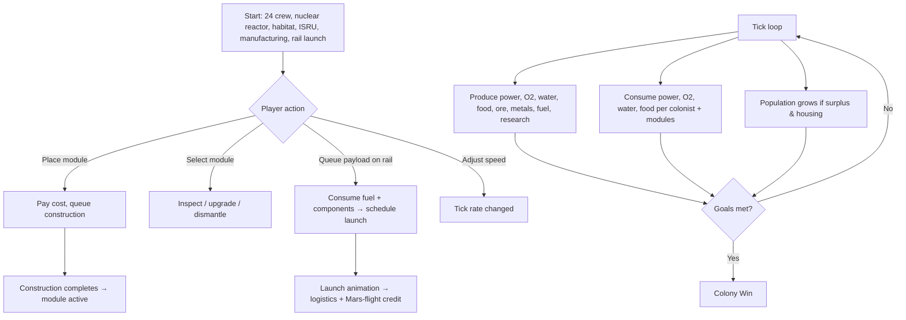

# MOONBASE 2050 — Product Requirements Document

## 1. Product Overview

A single-player, browser-based simulation game where the player designs, expands, and operates a fully self-sustaining lunar colony set in 2050, built cooperatively by ISRU (In-Situ Resource Utilization) and SpaceX, powered by portable nuclear fission modules. The endgame is to grow the base into a **10,000-person colony** that also functions as a mining & manufacturing hub for Mars exploration, a scientific research hub, and a logistics node within the broader cislunar base network. Earth resupply is available but expensive — the player is incentivized toward closed-loop autonomy.

- **Target users**: strategy/sim players, space enthusiasts, casual browsers
- **Market value**: zero-install H5 game, highly shareable, educationally flavored, retro-technical aesthetic

## 2. Core Features

### 2.2 Feature Modules

1. **Command Canvas (the map)**: top-down vector view of the base on a realistic shaded lunar terrain. Zoom, pan, place, select.
2. **Resource & Stats Engine**: real-time tick of power, oxygen, water, food, regolith ore, refined metals, fuel, population, research, logistics throughput.
3. **Build Palette**: catalog of buildable modules organized by category (Power, Habitat, Life Support, ISRU/Mining, Manufacturing, Research, Logistics, Rail Launch). Each item shows cost and prerequisites.
4. **Rail Launch Pad**: signature structure — queues payloads (satellites, equipment, Mars-bound ships) and "launches" them on a visible rail track animation, providing off-world logistics value.
5. **Colony Goals Panel**: progress toward 10k colonists, mining output targets, Mars logistics flights, research milestones.
6. **Event Log / Ticker**: minimal text feed of base events (resupply landed, ore vein depleted, Mars flight launched, dust storm).

### 2.3 Page / View Details

| View | Module | Feature description |
|------|--------|---------------------|
| Command Canvas | Lunar terrain | Procedurally generated heightmap rendered as a shaded relief (sun azimuth + hillshade) resembling Apollo photography; craters, maria, and rim highlights; subtle regolith color variance |
| Command Canvas | Building layer | Each module type rendered as a distinct, identifiable vector silhouette; selected module shows info ring + connection lines to power/logistics network |
| Command Canvas | Rail launch | Long diagonal rail track with gantry; when launching, payload travels along rail and leaves the map with a flash |
| Top HUD | Vitals | Compact icon row: population, power (+/-), oxygen, water, food, ore, metals, fuel, research, logistics; minimal numeric readouts |
| Bottom Dock | Build palette | Horizontal icon carousel grouped by category; click to enter placement mode |
| Side Panel | Selected module | Small floating card with module name, level, status, throughput, upgrade/dismantle actions |
| Side Panel | Goals | Compact progress bars toward colony milestones |
| Event Ticker | Bottom-left | Last 5 events with timestamps, auto-scrolling |

## 3. Core Process

The player starts on a small pre-seeded base: one portable nuclear reactor, one habitat, one greenhouse/ISRU oxygen + water plant, one small manufacturing bay, and the rail launch system — enough to sustain a starting crew of ~24. Each tick (~1 simulated hour per real second, configurable speed), resources are produced/consumed. The player places new modules from the palette, paying resource + colonist costs, waiting construction time. Reaching population thresholds unlocks new tech (research hub unlocks advanced modules, manufacturing tier 2 unlocks Mars ship components). The player wins by hitting 10k colonists **and** completing N Mars logistics flights **and** completing N research milestones.

## 4. User Interface Design

### 4.1 Design Style

- **Theme**: "mission control meets vector blueprint" — dark charcoal canvas, near-monochrome lunar surface, neon-amber and cyan accents for active UI, like a CRT ops console.
- **Primary colors**: deep lunar graphite `#0e0f12`, regolith grey `#3a3a40`, highlight cream `#e8e2d4`
- **Accent colors**: amber `#ffb454` (power/active), cyan `#56d4e0` (data/logistics), magenta `#e056a8` (warning), mint `#7be2a8` (positive)
- **Fonts**: display — `Space Mono` (technical monospace headers); body — `IBM Plex Mono` (HUD readouts). No Inter/Roboto.
- **Buttons**: thin-stroke rectangular, 1px border, no rounded corners, hover = amber fill + dark text. Icon-first.
- **Layout**: full-bleed canvas; floating thin-stroke panels; bottom dock palette; top-left HUD vitals; top-right goals; bottom-left event ticker.
- **Iconography**: all custom inline SVG vector icons (lucide-react allowed per dev guidelines), no raster icons anywhere.

### 4.2 Page Design Overview

| View | Module | UI Elements |
|------|--------|-------------|
| Command Canvas | Terrain | SVG `<filter>` hillshade + radial sun highlight; subtle grain overlay; crater rims as bright crescents |
| Command Canvas | Buildings | Distinct SVG silhouettes per type; soft glow when selected; dashed amber ring for placement preview |
| Top HUD | Vitals | 10 icon-stat chips, 2px-stroke, mono numerals, color-coded deltas |
| Bottom Dock | Palette | Category tabs (icons only) + scrollable icon list; selected item highlighted in amber |
| Side Panel | Module info | 220px floating panel, title, level pips, throughput bar, action buttons |
| Side Panel | Goals | 4 mini progress bars (pop, mars flights, research, logistics) |
| Event Ticker | Feed | Last 5 events, mono, faded timestamp prefix |

### 4.3 Responsiveness

- Desktop-first (1024px+ ideal). Canvas fills viewport.
- Tablet (768px+): HUD collapses to compact 2-row; palette becomes bottom sheet.
- Mobile (<768px): reduced zoom range; palette as full-screen sheet; touch drag = pan, pinch = zoom.
- Touch: long-press for selection menu, tap-place for placement.

### 4.4 Visual / Aesthetic Notes (no 3D)

- All visuals are 2D vector (SVG). Terrain is procedurally generated as an SVG/canvas heightmap and shaded by computing per-pixel luminance from a sun direction vector.
- Crater rims: bright crescent on sun-facing side, dark shadow inside.
- Buildings: each type has a unique outline + interior detail lines; subtle drop shadow for depth.
- Rail launch: long diagonal track with rail ties; payload glows amber during launch, leaves streak.

## 5. Module Catalog (initial scope)

**Power**
- Portable Nuclear Reactor (fission, high output, baseline)
- Solar Array (cheap, day-only, lower output)
- Battery Bank (storage buffer)

**Habitat**
- Crew Habitat (housing capacity)
- Residential Dome (large housing)
- Medical Bay (population health/growth rate)

**Life Support**
- ISRU Water Plant (regolith → water)
- ISRU Oxygen Plant (regolith → oxygen)
- Greenhouse (food + small O2)
- Waste Recycling (closes loops, reduces input demand)

**ISRU / Mining**
- Regolith Harvester (extracts ore)
- Regolith Excavator (deeper ore, higher yield)
- Helium-3 Extractor (rare resource for research/advanced tech)

**Manufacturing**
- Fab Bay (ore → metals)
- Parts Factory (metals → components)
- Shipyard (components + fuel → Mars ship payload)

**Research**
- Research Lab (generates research points)
- Observatory (research + logistics scanning)
- Mars Mission Control (boosts Mars flight throughput)

**Logistics**
- Storage Depot (capacity for ore/metals/fuel/components)
- Landing Pad (Earth resupply landings)
- Rover Depot (intra-base logistics efficiency)

**Signature**
- Rail Launch System (orbital/Mars payload launcher; required for all off-base launches)

## 6. Win Conditions

1. Population ≥ 10,000
2. Mars logistics flights completed ≥ 25
3. Research milestones completed ≥ 12
4. Maintain positive life-support balance for 60 consecutive ticks at end-game
