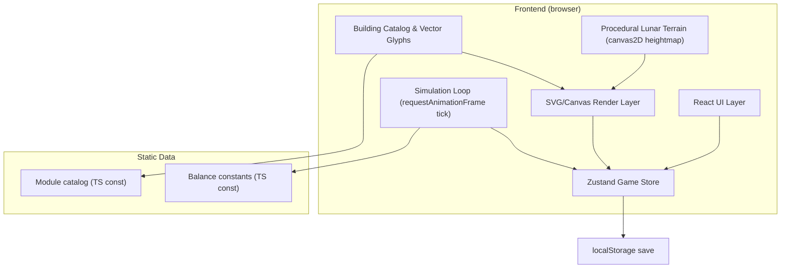

# MOONBASE 2050 — Technical Architecture

## 1. Architecture Design



No backend. Pure frontend, offline-capable, single-page React app. State persisted to `localStorage`.

## 2. Technology Description

- **Frontend**: React@18 + TypeScript + Vite
- **Styling**: Tailwind CSS@3 + custom CSS variables for theme tokens
- **State**: Zustand (single store, sliced by concern: resources, buildings, terrain, ui, events, goals)
- **Icons**: `lucide-react` for UI chrome; **custom inline SVG** for building glyphs (no raster assets)
- **Rendering**: hybrid — Canvas2D for the lunar terrain (per-pixel hillshade), SVG overlay for buildings, tracks, and selection rings (vector, zoom-friendly)
- **Save**: `localStorage` (autosave every 5 sim-hours + on manual save)
- **Fonts**: Google Fonts `Space Mono` + `IBM Plex Mono`
- **Init tool**: `vite-init` template `react-ts`

## 3. Route Definitions

Single-route app (`/`). Optional hash routes for in-game panels:

| Route | Purpose |
|-------|---------|
| `/` | The main game canvas (the only route) |

Modal panels (build palette, info, settings) are overlays, not routes.

## 4. Module / File Architecture

```
src/
├── App.tsx                     # root, mounts GameCanvas
├── main.tsx                    # entry
├── index.css                   # tailwind + tokens
├── store/
│   ├── gameStore.ts            # main zustand store
│   └── selectors.ts            # derived selectors (vitals, goals progress)
├── sim/
│   ├── tick.ts                 # core simulation step
│   ├── balance.ts              # balance constants
│   └── random.ts               # seeded RNG helpers
├── terrain/
│   ├── generator.ts            # procedural lunar heightmap (craters, maria)
│   ├── hillshade.ts            # sun-shaded relief renderer to canvas
│   └── types.ts
├── buildings/
│   ├── catalog.ts              # module catalog const (id, cost, stats, glyphs ref)
│   ├── glyphs.tsx              # SVG vector shapes per module type
│   └── placement.ts            # collision + validity checks
├── components/
│   ├── GameCanvas.tsx          # main viewport (canvas + svg overlay, pan/zoom)
│   ├── TerrainLayer.tsx        # renders hillshade canvas
│   ├── BuildingLayer.tsx       # renders buildings + selection
│   ├── RailLaunchLayer.tsx     # rail track + payload animation
│   ├── Hud.tsx                 # top vitals strip
│   ├── BuildPalette.tsx        # bottom dock module catalog
│   ├── ModuleInfoPanel.tsx     # selected module card
│   ├── GoalsPanel.tsx          # win-condition progress
│   ├── EventTicker.tsx         # event feed
│   ├── IntroOverlay.tsx        # first-load intro modal
│   └── icons/                  # custom ui svg icons
├── hooks/
│   ├── usePanZoom.ts           # pan/zoom/pinch interactions
│   ├── useGameLoop.ts          # rAF tick scheduler
│   └── useKeyboard.ts          # hotkeys (space=pause, b=build, esc=cancel)
├── pages/
│   └── GamePage.tsx            # the only page
└── utils/
    ├── format.ts               # number/time formatting
    └── geometry.ts             # vec math, screen<->world transform
```

## 5. Simulation Tick Design

- Real-time loop driven by `requestAnimationFrame`; accumulator pattern, fixed dt = 1 sim-hour per tick.
- Tick order: (1) produce, (2) consume, (3) trade/storage balance, (4) population growth, (5) construction progress, (6) research, (7) launch queue, (8) event log.
- Speed modes: paused / 1x / 2x / 4x.
- Terrain is computed once at worldgen (seeded), then static — only camera transform changes.

## 6. Data Model

### 6.1 Game State Shape (TS)

```ts
type ResourceId = 'power'|'oxygen'|'water'|'food'|'ore'|'metals'|'fuel'|'components'|'research'|'helium3'|'credits';

interface Resources { [k: string]: number; }       // current stockpile
interface Rates    { [k: string]: number; }        // per-tick net (display only)

interface BuildingInstance {
  id: string;
  typeId: BuildingTypeId;
  x: number; y: number;        // world coords
  level: number;
  status: 'construction'|'active'|'disabled'|'damaged';
  constructionProgress: number; // 0..1
  rotation: number;             // for visual variation / rail alignment
}

interface LaunchJob {
  id: string;
  payload: 'satellite'|'equipment'|'mars_ship';
  progress: number;             // 0..1
  readyAt: number;              // sim-time
}

interface GameEvent { id: string; t: number; kind: string; text: string; }

interface GameState {
  seed: number;
  simTime: number;                  // sim hours since start
  speed: 0|1|2|4;
  resources: Resources;
  rates: Rates;
  population: number;
  housingCapacity: number;
  buildings: BuildingInstance[];
  selectedBuildingId: string | null;
  placement: { typeId: BuildingTypeId } | null;
  launchQueue: LaunchJob[];
  events: GameEvent[];
  marsFlightsCompleted: number;
  researchMilestonesCompleted: number;
  win: boolean;
  paused: boolean;
}
```

### 6.2 Module Catalog Shape

```ts
interface ModuleDef {
  id: BuildingTypeId;
  category: 'power'|'habitat'|'life'|'isru'|'mfg'|'research'|'logistics'|'signature';
  name: string;
  blurb: string;
  cost: Partial<Resources>;
  buildTime: number;               // sim hours
  size: { w: number; h: number };  // footprint in world units
  // per-tick effects when active:
  production?: Partial<Resources>; // positive
  consumption?: Partial<Resources>;// negative inputs
  housing?: number;
  popRequired?: number;            // min colonists to operate
  prereq?: { pop?: number; researchMilestones?: number };
  maxLevel?: number;
}
```

### 6.3 Balance Constants (excerpt)

```ts
const POP_GROWTH_PER_TICK_PER_SURPLUS = 0.02;
const COLONIST_O2_PER_TICK = 0.05;
const COLONIST_WATER_PER_TICK = 0.04;
const COLONIST_FOOD_PER_TICK = 0.03;
const COLONIST_POWER_PER_TICK = 0.06;
const WIN_POP = 10000;
const WIN_MARS_FLIGHTS = 25;
const WIN_RESEARCH_MILESTONES = 12;
```

## 7. Terrain Generation Approach

1. Generate base elevation field on a coarse grid (e.g., 256×256) using value noise + a few large-scale "mare" depressions.
2. Stamp N craters (size distribution ~Apollo-like): each crater = raised rim ring + depressed interior + small central peak.
3. Compute hillshade from sun azimuth/elevation: per-pixel normal from elevation gradient, dot with sun vector → luminance.
4. Tint luminance into a regolith palette (cool grey midtones, warm rim highlights on sun-facing crater walls).
5. Cache to an offscreen canvas; only redraw on world regen. The visible viewport just blits a transformed slice.

## 8. Pan / Zoom Camera

- World coords ↔ screen coords via translate + scale matrix in Canvas2D (for terrain) and SVG `viewBox`/transform group (for buildings).
- Wheel = zoom-to-cursor; drag = pan; pinch (touch) = zoom.
- Clamp zoom 0.25x – 4x.
- Hotkeys: `+`/`-` zoom, arrow keys nudge, `0` recenter.

## 9. Build / Placement Flow

1. User clicks a module in BuildPalette → enters placement mode (`placement = { typeId }`).
2. Cursor shows ghost vector glyph at snapped world coords with dashed amber ring; collision check against existing footprints + restricted zones (e.g., not on steep slopes).
3. Click to commit: deduct resources, push `BuildingInstance` with `status: 'construction'`, `constructionProgress: 0`.
4. Tick advances construction; on completion status flips to `active`.
5. Esc cancels placement.

## 10. Rail Launch Flow

1. Player selects the Rail Launch System building.
2. Side panel offers three payload buttons (satellite / equipment / mars_ship) with their resource costs.
3. On commit: deduct resources, push `LaunchJob` with `progress: 0`.
4. Tick advances progress; on completion, increment `marsFlightsCompleted` (if mars_ship) or `logistics` rate bonus (other), trigger launch animation (payload travels along rail, leaves map with amber flash).

## 11. Save / Load

- Autosave every 5 sim-hours to `localStorage['moonbase.save']`.
- On load: deserialize into store, regenerate terrain from stored seed.
- Manual save / new game buttons in a settings modal.

## 12. Performance Budget

- Terrain render: 1 blit per frame (offscreen canvas slice). Negligible.
- Buildings: typically <500 active; SVG handles this fine; building layer uses memoized glyphs.
- Tick: O(buildings + events). Target 60 FPS at 4x speed on mid-tier laptop.

## 13. Out of Scope (v1)

- Multi-base / cislunar network view (abstracted as logistics rate).
- 3D view.
- Multiplayer.
- Sound (optional add-on).
- Random disasters beyond simple dust-storm events (a v1.1 goal).
